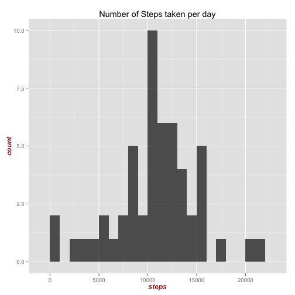
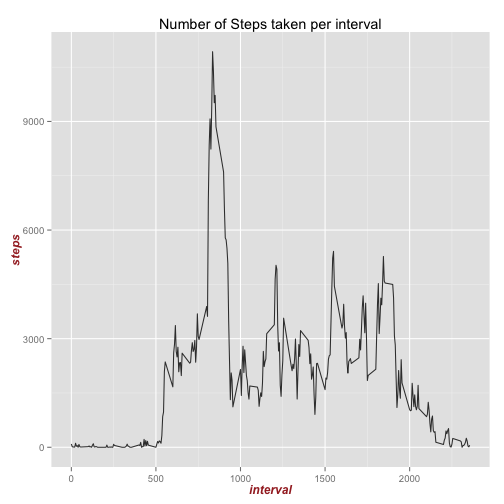
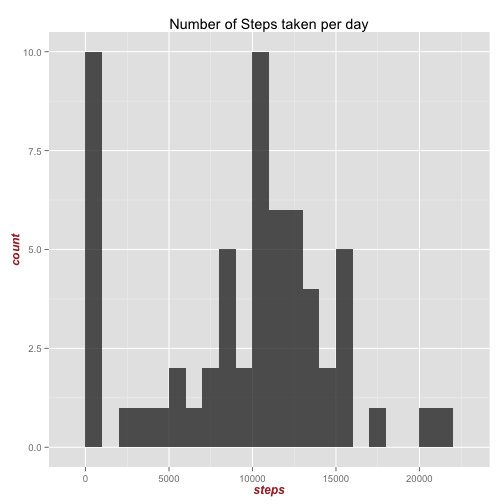
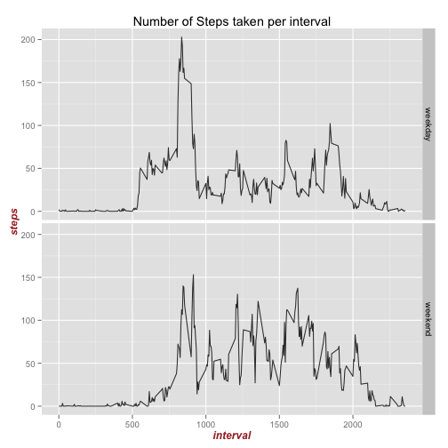

# Reproducible Research: Peer Assessment 1
The following libraries are essential to execute the scripts in this file:

```r
library(ggplot2)
```


## Loading and preprocessing the data
First, we unzip the data, and read the data in a dataframe.

```r
unzip("activity.zip")
data <- read.csv("activity.csv")
```


Second, we need to convert the date column from factor to date.

```r
data$date <- as.Date(data$date, "%Y-%m-%d")
```


Finally, we inspect the data, and make sure everything looks OK.

```r
names(data)
```

```
## [1] "steps"    "date"     "interval"
```

```r
head(data)
```

```
##   steps       date interval
## 1    NA 2012-10-01        0
## 2    NA 2012-10-01        5
## 3    NA 2012-10-01       10
## 4    NA 2012-10-01       15
## 5    NA 2012-10-01       20
## 6    NA 2012-10-01       25
```

```r
tail(data)
```

```
##       steps       date interval
## 17563    NA 2012-11-30     2330
## 17564    NA 2012-11-30     2335
## 17565    NA 2012-11-30     2340
## 17566    NA 2012-11-30     2345
## 17567    NA 2012-11-30     2350
## 17568    NA 2012-11-30     2355
```

```r
str(data)
```

```
## 'data.frame':	17568 obs. of  3 variables:
##  $ steps   : int  NA NA NA NA NA NA NA NA NA NA ...
##  $ date    : Date, format: "2012-10-01" "2012-10-01" ...
##  $ interval: int  0 5 10 15 20 25 30 35 40 45 ...
```

```r
summary(data)
```

```
##      steps            date               interval   
##  Min.   :  0.0   Min.   :2012-10-01   Min.   :   0  
##  1st Qu.:  0.0   1st Qu.:2012-10-16   1st Qu.: 589  
##  Median :  0.0   Median :2012-10-31   Median :1178  
##  Mean   : 37.4   Mean   :2012-10-31   Mean   :1178  
##  3rd Qu.: 12.0   3rd Qu.:2012-11-15   3rd Qu.:1766  
##  Max.   :806.0   Max.   :2012-11-30   Max.   :2355  
##  NA's   :2304
```


## What is mean total number of steps taken per day?
Make a histogram of the total number of steps taken each day.

```r
steps_per_day <- aggregate(steps ~ date, data, sum)
colnames(steps_per_day) <- c("date", "steps")
p <- qplot(data = steps_per_day, x = steps, geom = "bar", alpha = I(0.8), binwidth = 1000, 
    main = "Number of Steps taken per day")
p + theme(axis.title = element_text(face = "bold.italic", size = "12", color = "brown"), 
    legend.position = "top")
```

 

Calculate and report the mean and median total number of steps taken
per day.

```r
meanSteps <- round(mean(steps_per_day$steps))
medianSteps <- median(steps_per_day$steps)
```


For the total number of steps taken per day, the mean is 10766 and the median is 10765.

## What is the average daily activity pattern?

Make a time series plot (i.e. type = "l") of the 5-minute interval (x-axis)
and the average number of steps taken, averaged across all days (y-axis).


```r
steps_per_interval <- aggregate(steps ~ interval, data, sum, na.rm = T)
colnames(steps_per_interval) <- c("interval", "steps")
p <- qplot(data = steps_per_interval, x = interval, y = steps, geom = "line", 
    alpha = I(0.8), main = "Number of Steps taken per interval")
p + theme(axis.title = element_text(face = "bold.italic", size = "12", color = "brown"), 
    legend.position = "top")
```

 


Which 5-minute interval, on average across all the days in the dataset,
contains the maximum number of steps?

```r
max_steps <- max(steps_per_interval$steps)
max_interval <- which.max(steps_per_interval$steps)
```


The interval that has the maximum steps is interval: 835 with 10927 steps.

## Imputing missing values
Calculate and report the total number of missing values in the dataset
(i.e. the total number of rows with NAs)

```r
sum(is.na(data$steps))
```

```
## [1] 2304
```


Make a new dataframe from data, and fill in zeroes for missing values:

```r
imputed <- data.frame(data)
imputed$steps[is.na(data$steps)] <- 0
```


Make a histogram of the total number of steps taken each day from the imputed data frame.

```r
steps_per_day_imputed <- aggregate(steps ~ date, imputed, sum)
colnames(steps_per_day_imputed) <- c("date", "steps")
p <- qplot(data = steps_per_day_imputed, x = steps, geom = "bar", alpha = I(0.8), 
    binwidth = 1000, main = "Number of Steps taken per day")
p + theme(axis.title = element_text(face = "bold.italic", size = "12", color = "brown"), 
    legend.position = "top")
```

 

Calculate and report the mean and median total number of steps taken
per day.

```r
meanStepsImputed <- round(mean(steps_per_day_imputed$steps))
medianStepsImputed <- median(steps_per_day_imputed$steps)
```


For the total number of steps taken per day from the imputed dataframe, the mean is 9354 and the median is 10395. The imputation strategy used shifts the distribution towards lower bounds.


## Are there differences in activity patterns between weekdays and weekends?

Create a new factor variable in the dataset with two levels – “weekday”
and “weekend” indicating whether a given date is a weekday or weekend
day. Make a panel plot containing a time series plot (i.e. type = "l") of the
5-minute interval (x-axis) and the average number of steps taken, averaged
across all weekday days or weekend days (y-axis). The plot should look
something like the following, which was creating using simulated data:


```r
imputed$day_type <- as.factor(ifelse(weekdays(imputed$date) %in% c("Saturday", 
    "Sunday"), "weekend", "weekday"))
plot_data <- aggregate(steps ~ day_type + interval, imputed, mean)

p <- qplot(data = plot_data, x = interval, y = steps, facets = day_type ~ ., 
    geom = "line", alpha = I(0.8), main = "Number of Steps taken per interval")
p + theme(axis.title = element_text(face = "bold.italic", size = "12", color = "brown"), 
    legend.position = "top")
```

 

The data spikes in the mornings of the weekdays, obviously indicating that the subject is going to work. The weekend data is more adhoc.
